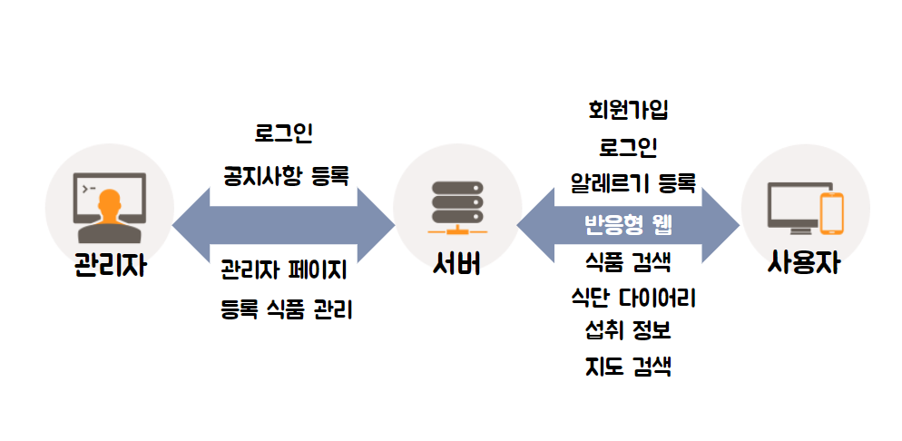
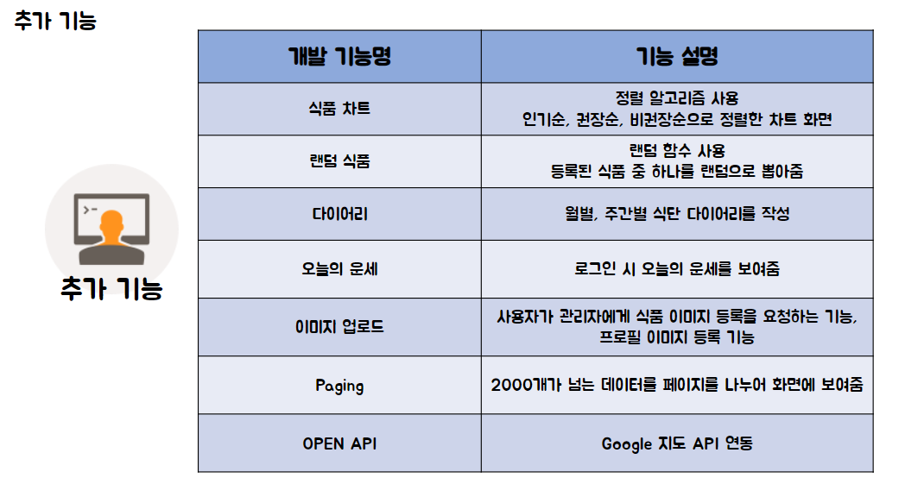
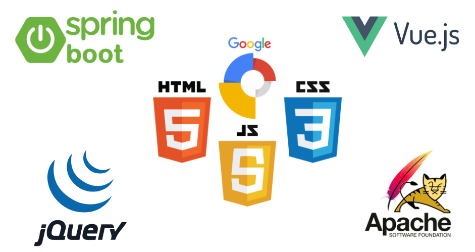

# 안전먹거리 웹 서비스


---
- [공공데이터를 이용한 안전 먹거리 정보제공 웹 프로젝트]

  - [서비스 개요](#서비스-개요)

  - [사용기술](#사용기술)

  - [My Role](#my-role)

  - [시연](#시연)

  - [Stack](#stack)

  - [Team](#team)

  - [License](#license)

  - [About](#about)

    

## 서비스 개요


```
- 상품의 재료, 성분, 칼로리 등을 제공합니다.

- 회원이 등록한 알러지 정보를 기반으로 해당 식품에 알러지 유무를 체크합니다.

- 일반 회원은 자신의 식단을 만들고 관리할 수 있습니다.

- 일반 회원은 등록된 식품 정보를 수정, 추가를 건의할 수 있습니다.

- 관리자는 회원들의 건의를 검토하고 사이트의 모든 권한을 가지고 있습니다.
```

## 사용기술
Spring Boot : MVC 패턴의 웹 구현

Mybatis : 회원, 게시글, 상품 등 CRUD 구현

Vue : QnA 페이지 구현

MultipartRequest : 이미지 업로드


## My Role
```
1. Spring Boot를 이용하여 MVC 패턴의 웹 구현
2. Mybatis를 이용하여 CRUD 구현
3. Vue를 이용한 QnA 페이지 구현
4. QnA 페이지를 위한 REST API 구현
5. 식품 이미지 업로드 기능 구현
6. 추천, 비추천 식품 알고리즘 구현
7. 관리자 모드
8. 부트스트랩을 이용한 반응형 페이지 구현
```

## 시연
### 기본기능
<iframe width="1008" height="506" src="https://www.youtube.com/embed/fg-J0MMd5DM" frameborder="0" allow="accelerometer; autoplay; encrypted-media; gyroscope; picture-in-picture" allowfullscreen></iframe>


### 추가기능


<iframe width="1008" height="506" src="https://www.youtube.com/embed/TgN0_GeOi2o" frameborder="0" allow="accelerometer; autoplay; encrypted-media; gyroscope; picture-in-picture" allowfullscreen></iframe>

## Stack


## Team
- 송원석
- 신광식
- 남동해

## License
MIT License

## About
Authored and maintained by **ssafy**
